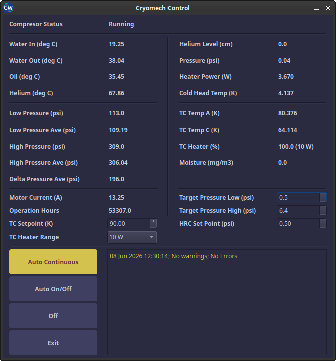
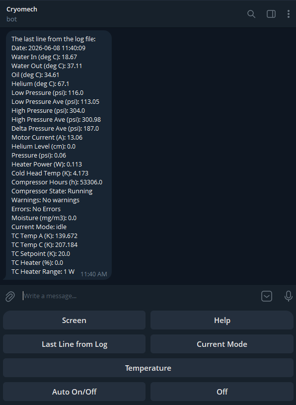

# Cryomech control center

The Cryomech control center is a standalone application, built on top of Atomize, that monitors and controls the cryogenic system. It supervises the helium compressor, the liquid-helium level, and the cold-head temperature of the closed-cycle cryostat, automates the compressor duty cycle, keeps a long-term log of every reading, and exposes remote monitoring and control through a Telegram bot.

All instrument communication reuses the standard Atomize [device modules](../instruments.md); the control center only adds the dedicated GUI, the automation logic, and the logging/bot layer on top.

## Monitored and controlled hardware

| Component                  | Model                                                | Role                                                                 |
| -------------------------- | ---------------------------------------------------- | ------------------------------------------------------------------- |
| Helium compressor          | Cryomech CPA1110 (RS-485)                            | Status, water/oil/helium temperatures, pressures, motor current, operating hours; start/stop |
| Liquid-helium level monitor | Cryomagnetics LM-510 (TCP/IP Socket)                | Helium level, pressure, heater power; HRC set point                 |
| Cold-head temperature      | Scientific Instruments SCM10 (TCP/IP Socket, RS-232) | Cold-head temperature                                               |
| Temperature controller     | Lakeshore 340 (GPIB, RS-232) — *optional*            | Sample temperatures (A / C), setpoint, heater power and range       |
| Moisture meter             | IVG-1/1 (RS-485) — *optional*                        | Cooling-water moisture                                              |

The Lakeshore 340 and the IVG-1/1 are optional: if either device is not wired up, the control center bypasses it and keeps running with the remaining instruments, greying out the controls that are not actionable.

## Cryomech Control window

The main window polls every connected device on a 5 s timer (all instrument I/O runs on a background thread so the GUI never freezes mid-read) and refreshes the live readouts. A reading from a dead instrument shows as `—` and only blanks its own labels — the rest of the rig keeps updating.

Besides displaying the readouts, the window lets the operator:

- set the **HRC Set Point** (LM-510 helium recondenser target pressure);
- set the Lakeshore 340 **TC Setpoint** and **TC Heater Range**;
- choose one of three compressor operating modes (see below).

Front-panel edits made directly on the instruments are synced back into the GUI on the next poll, so the displayed values always track the hardware.

### Compressor operating modes

| Mode               | Behaviour                                                                                                       |
| ------------------ | ------------------------------------------------------------------------------------------------------------- |
| **Auto Continuous** | Keeps the compressor running; restarts it automatically if it is found idling.                                 |
| **Auto On/Off**     | Cycles the compressor between the **Target Pressure Low** and **Target Pressure High** thresholds to hold the helium pressure in a band. |
| **Off**             | Stops the compressor and keeps it off.                                                                         |

## Logging

Every reading is appended to a tab-separated log file (`Cryomech.log`, one row per minute, rotated weekly). The bundled **Log Analyzer** window plots any logged quantity (temperatures, pressures, helium level, moisture, motor current, …) against time using the Atomize [liveplot](../functions/plotting_functions/usage.md) graphics, which makes it easy to review long-term trends and diagnose problems after the fact.

## Telegram bot

A Telegram bot provides remote monitoring and control from a phone. After authorizing a chat ID, the operator can:

- request a **screenshot** of the control window;
- read the **last log line** and the **current operating mode**;
- read the **temperature-controller** data;
- switch the compressor between **Auto On/Off**, **Auto Continuous**, and **Off**;
- set the TC **setpoint** (`sp50` → 50 K) and **heater range** (`sh10` / `sh1` / `shoff`).

Commands sent from the bot are handed to the control window through a small file-based handshake, so the bot never talks to the instruments directly — the control window remains the single owner of all device I/O.

## Autostart

On Linux the control center can be launched at login (`atomize-itc --autostart`), in which case it comes back up in the same operating mode the previous session was in, so a power cycle does not interrupt the cryogenic automation.
